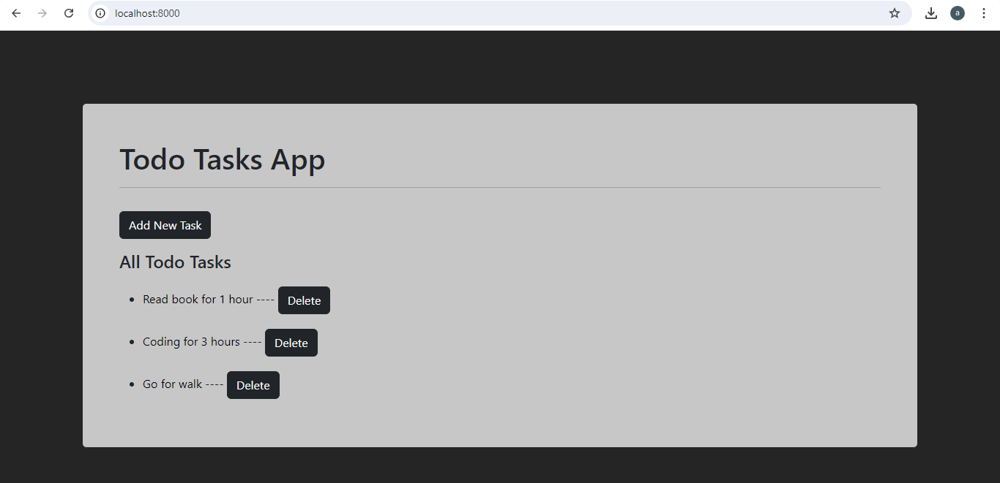

# Django Todo Project
The "ToDo" project is a Django-based application focused on task management. It features a CRUD system where users can create, update, and delete tasks. This project highlights the core functionalities of Django, offering a straightforward solution for managing tasks while demonstrating the practical use of Django's capabilities in web development.

## 🛠 Skills
HTML, CSS, Python, Django, Bootstrap

## Screenshots

